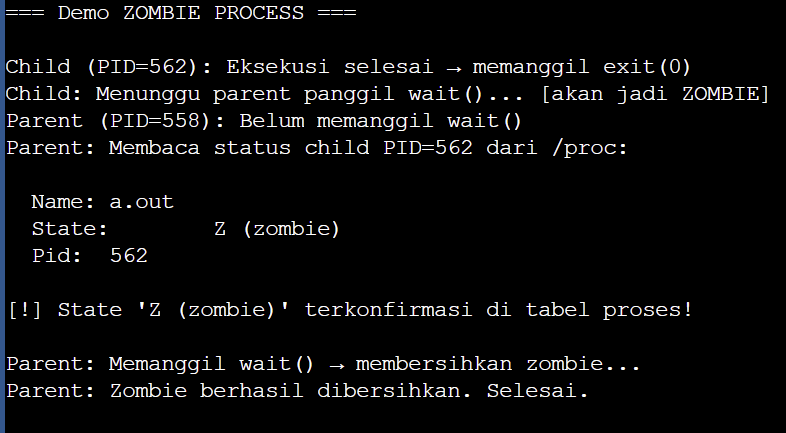
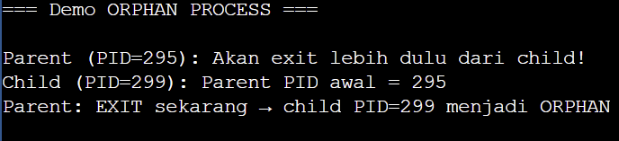
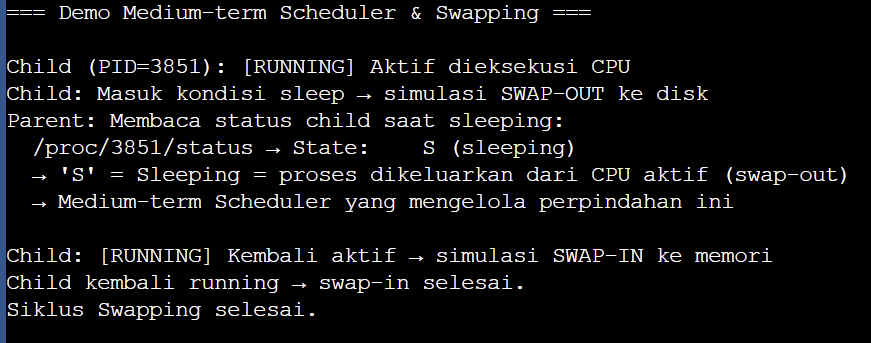
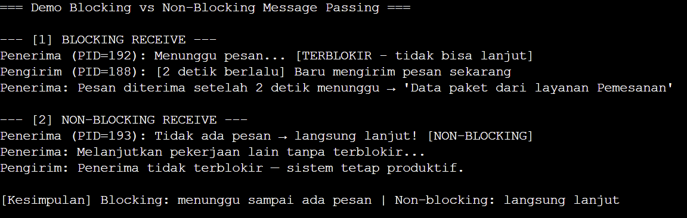
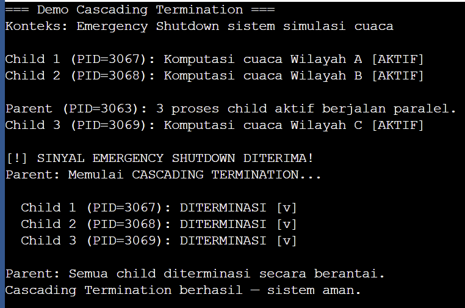
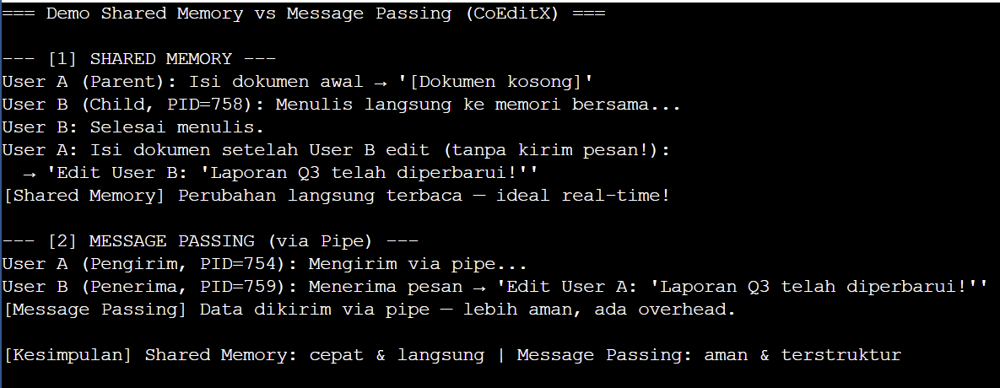

# Sistem_Operasi-140810250045---Daniel---Tugas7
140810250045 Daniel Chang menyelesaikan tugas sistem operasi

# Tugas Sistem Operasi: Manajemen Proses (Sesi 3)
**Beserta Implementasi Kode Program C dan Hasil Eksekusi**

---

## Soal 1 - Kategori Sederhana (Definisi): Zombie & Orphan Process

**Pertanyaan:**
Dalam siklus hidup proses pada sistem operasi, terdapat dua kondisi abnormal yang dapat dialami sebuah proses setelah terminasi: *Zombie Process* dan *Orphan Process*. Berdasarkan konsep manajemen proses, definisikan masing-masing kondisi tersebut dan jelaskan apa yang menyebabkan keduanya terjadi!

**Jawaban:**
*   **Zombie Process** adalah kondisi di mana sebuah proses telah selesai dieksekusi (memanggil `exit()`), namun entri PCB-nya masih dipertahankan di tabel proses oleh sistem operasi karena proses *parent*-nya belum memanggil `wait()` untuk membaca *exit status* dari *child* tersebut. Proses ini secara fungsional sudah mati, tetapi masih "menghantui" tabel proses.
*   **Orphan Process** adalah kondisi di mana proses *parent* diterminasi lebih dahulu sebelum proses *child*-nya selesai bekerja, sehingga *child* tersebut kehilangan *parent*-nya dan menjadi yatim. Pada sistem UNIX, kondisi ini ditangani dengan cara sistem operasi melalui proses `init` (PID 1) atau `systemd` secara otomatis mengadopsi seluruh *orphan process* yang ada.
*   **Penyebab utama:** Zombie timbul karena kelalaian *parent* dalam memanggil `wait()`, sedangkan Orphan timbul karena terminasi *parent* yang lebih dulu sebelum *child* selesai bekerja.

### Implementasi Kode 1a: Zombie Process
```c
#include <stdio.h>
#include <stdlib.h>
#include <unistd.h>
#include <string.h>
#include <sys/wait.h>

int main() {
    printf("=== Demo ZOMBIE PROCESS ===\n\n");

    pid_t pid = fork();

    if (pid == 0) {
        printf("Child (PID=%d): Eksekusi selesai → memanggil exit(0)\n", getpid());
        printf("Child: Menunggu parent panggil wait()... [akan jadi ZOMBIE]\n");
        exit(0);
    } else {
        sleep(1); // Tunggu child exit → jadi zombie

        char path[64], line[128];
        sprintf(path, "/proc/%d/status", pid);
        FILE *f = fopen(path, "r");

        printf("Parent (PID=%d): Belum memanggil wait()\n", getpid());
        printf("Parent: Membaca status child PID=%d dari /proc:\n\n", pid);

        if (f) {
            while (fgets(line, sizeof(line), f)) {
                if (strncmp(line, "Name:", 5) == 0 ||
                    strncmp(line, "State:", 6) == 0 ||
                    strncmp(line, "Pid:", 4) == 0) {
                    printf("  %s", line);
                }
            }
            fclose(f);
        }

        printf("\n[!] State 'Z (zombie)' terkonfirmasi di tabel proses!\n");
        printf("\nParent: Memanggil wait() → membersihkan zombie...\n");
        wait(NULL);
        printf("Parent: Zombie berhasil dibersihkan. Selesai.\n");
    }
    return 0;
}
```

**Hasil Eksekusi Program 1a:**  


### Implementasi Kode 1b: Orphan Process
```c
#include <stdio.h>
#include <stdlib.h>
#include <unistd.h>

int main() {
    printf("=== Demo ORPHAN PROCESS ===\n\n");

    pid_t pid = fork();

    if (pid == 0) {
        fflush(stdout);
        printf("Child (PID=%d): Parent PID awal = %d\n", getpid(), getppid());
        fflush(stdout);
        sleep(2); // Tunggu parent exit duluan
        printf("Child (PID=%d): Parent PID sekarang = %d", getpid(), getppid());
        if (getppid() <= 2) {
            printf(" ← diadopsi init/systemd! [STATUS: ORPHAN]\n");
        } else {
            printf(" ← diadopsi oleh sistem\n");
        }
        fflush(stdout);
        exit(0);
    } else {
        printf("Parent (PID=%d): Akan exit lebih dulu dari child!\n", getpid());
        sleep(1);
        printf("Parent: EXIT sekarang → child PID=%d menjadi ORPHAN\n\n", pid);
        fflush(stdout);
        exit(0); // Parent exit duluan
    }
}
```

**Hasil Eksekusi Program 1b:**  


---

## Soal 2 - Kategori Sederhana (Definisi): Medium-term Scheduler

**Pertanyaan:**
Selain *Long-term Scheduler* dan *Short-term Scheduler*, sistem operasi juga mengenal *Medium-term Scheduler*. Jelaskan definisi dan fungsi *Medium-term Scheduler*, serta apa yang dimaksud dengan mekanisme swapping yang dikelolanya!

**Jawaban:**
*   **Medium-term Scheduler** adalah komponen penjadwalan sistem operasi yang bertugas mengelola pemindahan proses keluar-masuk memori utama (*main memory*) secara sementara, dengan tujuan mengurangi *degree of multiprogramming* apabila sistem mengalami kelebihan beban.
*   **Mekanisme Swapping** adalah proses memindahkan (*swap out*) sebuah proses dari memori utama ke penyimpanan sekunder (disk) untuk sementara waktu, lalu memindahkannya kembali (*swap in*) ke memori utama ketika kondisi sistem memungkinkan. Tujuannya adalah membebaskan ruang memori agar proses-proses lain yang lebih mendesak dapat dieksekusi tanpa harus menterminasi proses yang sedang berjalan.

### Implementasi Kode 2: Simulasi Swapping
```c
#include <stdio.h>
#include <stdlib.h>
#include <unistd.h>
#include <string.h>
#include <sys/wait.h>

void baca_status(pid_t pid) {
    char path[64], line[128];
    sprintf(path, "/proc/%d/status", pid);
    FILE *f = fopen(path, "r");
    if (f) {
        while (fgets(line, sizeof(line), f)) {
            if (strncmp(line, "State:", 6) == 0) {
                printf("  /proc/%d/status → %s", pid, line);
                break;
            }
        }
        fclose(f);
    }
}

int main() {
    printf("=== Demo Medium-term Scheduler & Swapping ===\n\n");

    pid_t pid = fork();

    if (pid == 0) {
        printf("Child (PID=%d): [RUNNING] Aktif dieksekusi CPU\n", getpid());
        printf("Child: Masuk kondisi sleep → simulasi SWAP-OUT ke disk\n");
        fflush(stdout);
        sleep(4);
        printf("Child: [RUNNING] Kembali aktif → simulasi SWAP-IN ke memori\n");
        exit(0);
    } else {
        sleep(1);
        printf("Parent: Membaca status child saat sleeping:\n");
        baca_status(pid);
        printf("  → 'S' = Sleeping = proses dikeluarkan dari CPU aktif (swap-out)\n");
        printf("  → Medium-term Scheduler yang mengelola perpindahan ini\n\n");
        wait(NULL);
        printf("Child kembali running → swap-in selesai.\n");
        printf("Siklus Swapping selesai.\n");
    }
    return 0;
}
```

**Hasil Eksekusi Program 2:**  


---

## Soal 3 - Kategori Menengah (Fungsi): Message Passing

**Pertanyaan:**
Dalam model *Message Passing* pada IPC, pengiriman dan penerimaan pesan dapat dilakukan secara *Blocking* (*Synchronous*) maupun *Non-blocking* (*Asynchronous*). Jelaskan cara kerja masing-masing pendekatan pada operasi `send()` dan `receive()`, serta identifikasi situasi di mana masing-masing pendekatan lebih menguntungkan untuk digunakan!

**Jawaban:**
*   **Blocking Send (Synchronous):** Proses pengirim akan diblokir dan tidak dapat melanjutkan eksekusinya sampai pesan yang dikirimkan berhasil diterima. Menjamin kepastian pengiriman, namun proses pengirim menjadi tidak produktif selama menunggu.
*   **Non-blocking Send (Asynchronous):** Proses pengirim mengirimkan pesan dan langsung melanjutkan eksekusinya tanpa menunggu konfirmasi penerimaan. Tidak ada jaminan kapan pesan diterima, tapi pengirim tetap produktif.
*   **Blocking Receive:** Proses penerima akan diblokir hingga ada pesan yang tersedia untuk diterima.
*   **Non-blocking Receive:** Proses penerima memeriksa ada tidaknya pesan; jika tidak ada, ia menerima nilai *null* dan langsung melanjutkan eksekusinya.
*   **Situasi Penggunaan:** *Blocking* cocok digunakan saat urutan dan kepastian data sangat kritikal (seperti transaksi sistem). *Non-blocking* lebih cocok saat proses pengirim tidak perlu menunggu respons untuk tetap produktif (seperti *event-driven architecture*).

### Implementasi Kode 3: Blocking vs Non-Blocking
```c
#include <stdio.h>
#include <stdlib.h>
#include <unistd.h>
#include <string.h>
#include <fcntl.h>
#include <time.h>
#include <sys/wait.h>

int main() {
    printf("=== Demo Blocking vs Non-Blocking Message Passing ===\n\n");

    // DEMO 1: BLOCKING
    printf("--- [1] BLOCKING RECEIVE ---\n");
    int pipe1[2];
    pipe(pipe1);

    pid_t pid1 = fork();
    if (pid1 == 0) {
        close(pipe1[1]);
        char buf[128];
        time_t t1 = time(NULL);
        printf("Penerima (PID=%d): Menunggu pesan... [TERBLOKIR - tidak bisa lanjut]\n", getpid());
        fflush(stdout);
        read(pipe1[0], buf, sizeof(buf)); // BLOCKING
        time_t t2 = time(NULL);
        printf("Penerima: Pesan diterima setelah %ld detik menunggu → '%s'\n", t2-t1, buf);
        close(pipe1[0]);
        exit(0);
    } else {
        close(pipe1[0]);
        sleep(2);
        printf("Pengirim (PID=%d): [2 detik berlalu] Baru mengirim pesan sekarang\n", getpid());
        char *msg = "Data paket dari layanan Pemesanan";
        write(pipe1[1], msg, strlen(msg)+1);
        close(pipe1[1]);
        waitpid(pid1, NULL, 0);
    }

    // DEMO 2: NON-BLOCKING
    printf("\n--- [2] NON-BLOCKING RECEIVE ---\n");
    int pipe2[2];
    pipe(pipe2);
    fcntl(pipe2[0], F_SETFL, O_NONBLOCK); // Set non-blocking

    pid_t pid2 = fork();
    if (pid2 == 0) {
        close(pipe2[1]);
        char buf[128];
        int n = read(pipe2[0], buf, sizeof(buf));
        if (n == -1) {
            printf("Penerima (PID=%d): Tidak ada pesan → langsung lanjut! [NON-BLOCKING]\n", getpid());
            printf("Penerima: Melanjutkan pekerjaan lain tanpa terblokir...\n");
        }
        close(pipe2[0]);
        exit(0);
    } else {
        close(pipe2[0]);
        sleep(1);
        waitpid(pid2, NULL, 0);
        printf("Pengirim: Penerima tidak terblokir — sistem tetap produktif.\n");
    }

    printf("\n[Kesimpulan] Blocking: menunggu sampai ada pesan | Non-blocking: langsung lanjut\n");
    return 0;
}
```

**Hasil Eksekusi Program 3:**  


---

## Soal 4 - Kategori Sulit (Studi Kasus): Cascading Termination

**Pertanyaan:**
Sebuah tim pengembang sedang membangun sistem simulasi cuaca *real-time* untuk Badan Meteorologi Nasional. Program utama (*parent*) menerima data sensor dan menciptakan puluhan proses *child* untuk menjalankan komputasi paralel. Saat *emergency shutdown* terjadi, seluruh proses *child* harus diterminasi bersama *parent*-nya. Jelaskan mekanisme *Cascading Termination* dalam skenario ini, dan analisislah dampaknya jika tidak diterapkan!

**Jawaban:**
*   **Cascading Termination** adalah mekanisme di mana ketika sebuah proses *parent* diterminasi, sistem operasi secara otomatis menterminasi seluruh proses *child* dan keturunannya secara berantai. Dalam simulasi ini, terminasi pada *parent* akan memicu perintah OS untuk otomatis mematikan puluhan *child* komputasi cuaca tersebut.
*   **Analisis Jika Tidak Diterapkan:** Seluruh proses *child* komputasi cuaca akan menjadi *Orphan Process* yang terus berjalan dan mengonsumsi sumber daya CPU serta memori, meski *parent*-nya sudah tidak ada. Kondisi ini dapat menyebabkan pemborosan sumber daya secara masif dan instabilitas sistem operasi.

### Implementasi Kode 4: Cascading Termination
```c
#include <stdio.h>
#include <stdlib.h>
#include <unistd.h>
#include <signal.h>
#include <sys/wait.h>

int main() {
    printf("=== Demo Cascading Termination ===\n");
    printf("Konteks: Emergency Shutdown sistem simulasi cuaca\n\n");

    pid_t child1, child2, child3;

    child1 = fork();
    if (child1 == 0) {
        printf("Child 1 (PID=%d): Komputasi cuaca Wilayah A [AKTIF]\n", getpid());
        sleep(30); exit(0);
    }

    child2 = fork();
    if (child2 == 0) {
        printf("Child 2 (PID=%d): Komputasi cuaca Wilayah B [AKTIF]\n", getpid());
        sleep(30); exit(0);
    }

    child3 = fork();
    if (child3 == 0) {
        printf("Child 3 (PID=%d): Komputasi cuaca Wilayah C [AKTIF]\n", getpid());
        sleep(30); exit(0);
    }

    printf("\nParent (PID=%d): 3 proses child aktif berjalan paralel.\n", getpid());
    sleep(2);

    printf("\n[!] SINYAL EMERGENCY SHUTDOWN DITERIMA!\n");
    printf("Parent: Memulai CASCADING TERMINATION...\n\n");

    kill(child1, SIGTERM);
    waitpid(child1, NULL, 0);
    printf("  Child 1 (PID=%d): DITERMINASI [v]\n", child1);

    kill(child2, SIGTERM);
    waitpid(child2, NULL, 0);
    printf("  Child 2 (PID=%d): DITERMINASI [v]\n", child2);

    kill(child3, SIGTERM);
    waitpid(child3, NULL, 0);
    printf("  Child 3 (PID=%d): DITERMINASI [v]\n", child3);

    printf("\nParent: Semua child diterminasi secara berantai.\n");
    printf("Cascading Termination berhasil — sistem aman.\n");
    return 0;
}
```

**Hasil Eksekusi Program 4:**  


---

## Soal 5 - Kategori Sulit (Studi Kasus & Optimasi): IPC CoEditX

**Pertanyaan:**
Platform kolaborasi "CoEditX" memungkinkan banyak pengguna mengedit dokumen yang sama secara bersamaan. Tim arsitektur berdebat menggunakan *Shared Memory* versus *Message Passing* sebagai solusi IPC-nya. Analisislah kelebihan dan kekurangan masing-masing pendekatan dalam konteks CoEditX, lalu rekomendasikan pendekatan yang paling sesuai beserta justifikasinya!

**Jawaban:**
*   **Shared Memory:**
    *   *Kelebihan:* Sangat cepat karena data dipertukarkan langsung melalui memori tanpa keterlibatan sistem operasi setelah setup awal. Ideal untuk volume data besar secara real-time.
    *   *Kekurangan:* Butuh mekanisme sinkronisasi manual yang kompleks untuk menghindari *race condition* antar pengguna.
*   **Message Passing:**
    *   *Kelebihan:* Lebih aman dari konflik karena sistem operasi yang mengelola. Sangat cocok jika arsitekturnya terdistribusi di berbagai mesin jaringan.
    *   *Kekurangan:* *Overhead* sangat tinggi, sehingga kurang efisien untuk aplikasi real-time yang butuh perubahan data secara instan dan terus-menerus.
*   **Rekomendasi:** Untuk CoEditX yang beroperasi dalam **satu server**, pendekatan **Shared Memory** adalah yang paling optimal karena tuntutan kecepatan *real-time* adalah fitur krusial. Namun, *engineer* wajib menyiapkan sinkronisasi (*mutex*) pada tingkat aplikasi.

### Implementasi Kode 5: Shared Memory vs Message Passing
```c
#include <stdio.h>
#include <stdlib.h>
#include <unistd.h>
#include <sys/mman.h>
#include <sys/wait.h>
#include <string.h>

int main() {
    printf("=== Demo Shared Memory vs Message উভয় (CoEditX) ===\n\n");

    // DEMO 1: SHARED MEMORY
    printf("--- [1] SHARED MEMORY ---\n");
    char *shared = mmap(NULL, 4096, PROT_READ|PROT_WRITE,
                        MAP_SHARED|MAP_ANONYMOUS, -1, 0);
    strcpy(shared, "[Dokumen kosong]");

    pid_t pid1 = fork();
    if (pid1 == 0) {
        sleep(1);
        printf("User B (Child, PID=%d): Menulis langsung ke memori bersama...\n", getpid());
        strcpy(shared, "Edit User B: 'Laporan Q3 telah diperbarui!'");
        printf("User B: Selesai menulis.\n");
        exit(0);
    } else {
        printf("User A (Parent): Isi dokumen awal → '%s'\n", shared);
        wait(NULL);
        printf("User A: Isi dokumen setelah User B edit (tanpa kirim pesan!):\n");
        printf("  → '%s'\n", shared);
        printf("[Shared Memory] Perubahan langsung terbaca — ideal real-time!\n");
        munmap(shared, 4096);
    }

    // DEMO 2: MESSAGE PASSING
    printf("\n--- [2] MESSAGE PASSING (via Pipe) ---\n");
    int pipefd[2];
    pipe(pipefd);

    pid_t pid2 = fork();
    if (pid2 == 0) {
        close(pipefd[1]);
        char buf[256];
        read(pipefd[0], buf, sizeof(buf));
        printf("User B (Penerima, PID=%d): Menerima pesan → '%s'\n", getpid(), buf);
        close(pipefd[0]);
        exit(0);
    } else {
        close(pipefd[0]);
        char *pesan = "Edit User A: 'Laporan Q3 telah diperbarui!'";
        printf("User A (Pengirim, PID=%d): Mengirim via pipe...\n", getpid());
        write(pipefd[1], pesan, strlen(pesan)+1);
        close(pipefd[1]);
        wait(NULL);
        printf("[Message Passing] Data dikirim via pipe — lebih aman, ada overhead.\n");
    }

    printf("\n[Kesimpulan] Shared Memory: cepat & langsung | Message Passing: aman & terstruktur\n");
    return 0;
}
```

**Hasil Eksekusi Program 5:**  






